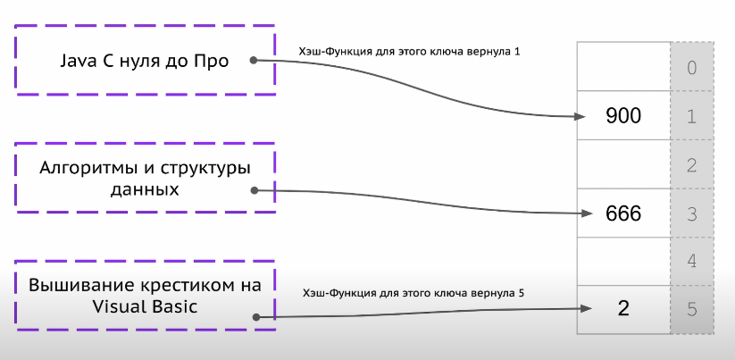
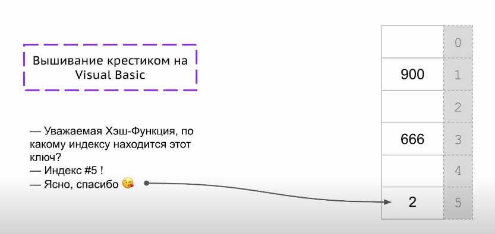
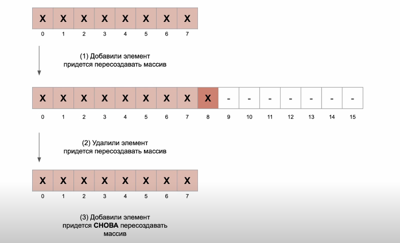
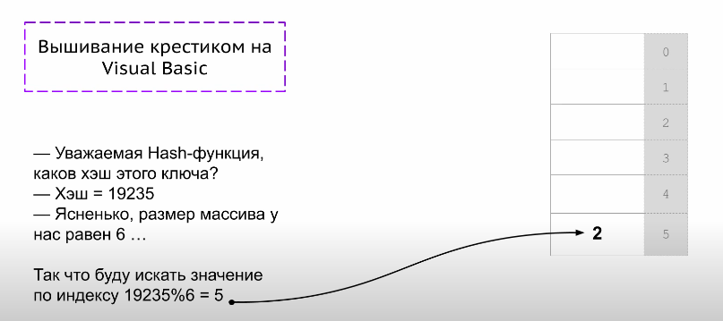
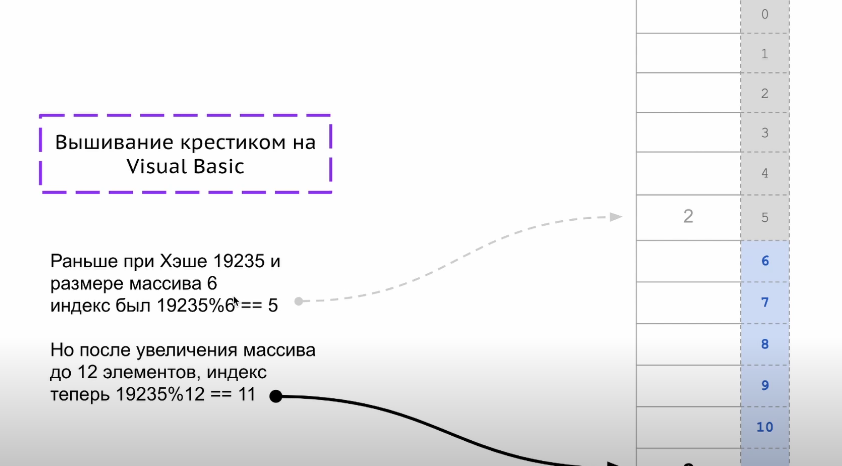

Структура данных, представляющая собой набор пар ключ-значение.  
Хранить соответствие между ключом и значением - основная цель.  

В основе обычный массив и хэш-функции (по ключу возвращает индекс в массиве).  

  

Для одного и того же набора данных, хэш-функция должна возвращать одного и то же значение.  

Хэш-функция возвращает одно значение для разных ключей - коллизия.  Время выполнения фиксированное. 

В основе большинства структур данных лежит массив.  
В структуры добавляются элементы и удаляются => нужно как-то регулировать длину, чтобы экономно
использовать память.  

Массив увеличивается в 2 раза (пересоздание с копированием вызывается не так часто).
Уменьшается массив, когда заполнен на 1/4.

  

